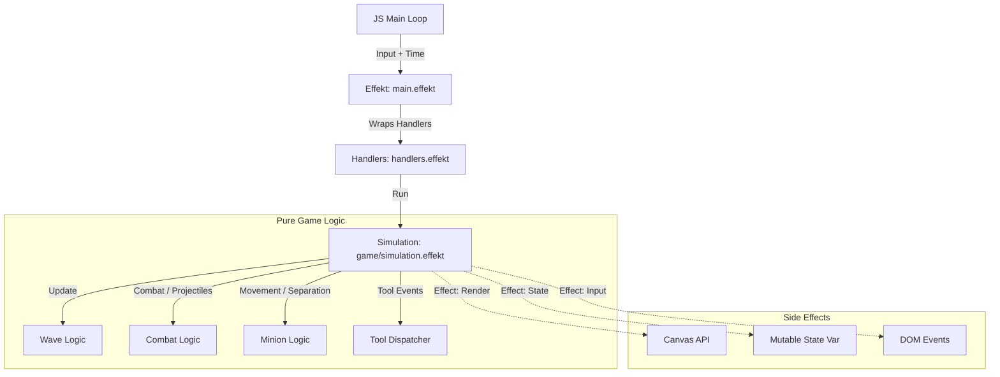

# Architecture Documentation - Wave Management Sim

## 1. Overview

This project is a **League of Legends Wave Management Simulator** built in **Effekt**, a functional programming language with an advanced effect system. The application runs in the browser, compiling Effekt code to JavaScript, and renders the game using the HTML5 Canvas API.
---

## 2. High-Level Architecture

The architecture follows a standard **Game Loop** pattern but implemented functionally:

1.  **Browser/JS Layer**: manages the `requestAnimationFrame` loop and holds the persistent state between frames.
2.  **Interop Bridge**: calls into the compiled Effekt runtime every frame (`processFrameImpl`).
3.  **Effect Handlers**: The entry point wraps the game logic in handlers for `State`, `Render`, `Input`, and `Time`.
4.  **Simulation Core**: Pure logic functions update the game state based on inputs and time delta.
5.  **Rendering**: The game state is visualized by invoking abstract `Render` effects, which the handlers translate to Canvas API calls.

### Data Flow Diagram

---

## 3. Directory Structure and Modules

The `src/` directory is organized by responsibility:

### Core
*   `main.effekt`: Entry point. Initializes Canvas, Events, and the main game loop.
*   `types.effekt`: Domain models (`GameState`, `Minion`, `Turret`, `WaveState`) and configuration constants.
*   `effects.effekt`: Definition of algebraic effects (`State`, `Render`, `Input`, `Time`) and helper getters/setters.
*   `handlers.effekt`: Implementation of effects. Contains the actual drawing logic (`drawMinion`, `drawLane`) and state management.

### Game Logic (`src/game/`)
*   `simulation.effekt`: Orchestrates the update loop. Calls Wave -> Minion -> Combat -> Render.
*   `wave.effekt`: Handles spawn timers (`scheduleTeamWave`), and analyzes minion positions to determine `WaveState` (Frozen, Pushing, etc.).
*   `combat.effekt`: Handles all damage calculations, targeting rules, turret agro, and projectile physics (`updateProjectiles`).
*   `minion.effekt`: Handles movement physics, including separation forces (boids-like) and lane clamping.
*   `turret.effekt`: Simple turret creation helpers.
*   `state.effekt`: `createInitialState` factory.

### Tools (`src/tools/`)
*   `dispatcher.effekt`: Routes user clicks to specific tool implementations based on `selectedTool`.
*   `mechanics modules`: Individual logic for `lasthit`, `aoe`, `clear`, `tank` tools.

### FFI (`src/ffi/`)
*   `canvas.effekt`: Low-level Javascript bindings for the HTML5 Canvas 2D Context.
*   `events.effekt`: Bindings to browser events (mouse coordinates, clicks, key presses) and global input state management.

### Utils (`src/utils/`)
*   `math.effekt`: Vector math (`Vec2`), collision detection, and clamping helpers.
*   `lists.effekt`: Generic list operations used throughout the functional codebase.
*   `game.effekt`: Domain-specific utilities (e.g., team swapping, speed multipliers, wave state names).

---

## 4. Key Components Detail

### 4.1. The Effect System
The project relies heavily on Effekt's algebraic effects to define capabilities. This allows us to "mock" capabilities for testing (e.g., `withMockState`) or provide real implementations for things like Rendering.

### 4.2. The Simulation Loop (`game/simulation.effekt`)
The `gameLoopStep` function is the heart of the simulation. It performs three distinct phases per frame:

1.  **Input Handling**:
    *   Checks for tool usage (mouse clicks) via `handleToolClick`.
    *   Checks for keyboard shortcuts (pausing, changing game speed).
2.  **Simulation Update** (`simulationStep`):
    *   **Wave Scheduling**: `checkAndScheduleWaves` determines if new minions need to spawn.
    *   **Movement**: `updateAllMinions` applies movement vectors, separation forces, and keeping units in bounds.
    *   **Combat**: `processCombat` handles targeting, damage application, and **projectile simulation**.
    *   **Cleanup**: Removes dead entities.
    *   **State Analysis**: `calculateWaveState` updates the equilibrium status (e.g., "Slow Push").
3.  **Rendering** (`renderGame`):
    *   Clears the screen.
    *   Draws the lane, turrets, minions, projectiles, and UI.

### 4.3. Foreign Function Interface (FFI)
To interact with the Web Platform, we use `extern js` blocks.
*   **`ffi/canvas.effekt`**: Maps functions like `fillCircle` directly to `ctx.arc()` calls in JavaScript.
*   **`ffi/events.effekt`**: Maintains global JS variables for input state (e.g., `window.$mouseX`) which are polled by the Effekt handlers.

---

## 5. Developer Guide: How to extend

### Adding a new feature (e.g., a new Minion Type)

1.  **Define Data**: Update `src/types.effekt` to include the new variant (e.g., `SuperMinion()`).
2.  **Update Stats**: In `src/game/minion.effekt`, update `getMinionStats` to define HP/Damage.
3.  **Update Rendering**: Add a new case in `src/handlers.effekt` inside `drawMinion` (define color/shape).
4.  **Update Spawning**: In `src/game/wave.effekt`, add the new type to `scheduleTeamWave` to make it appear in game.

### Adding a new Visual Effect

1.  **Define Effect**: Add a case to `VisualEffectType` in `types.effekt`.
2.  **Trigger Effect**: In the simulation logic (e.g., `combat.effekt`), add the effect to the `state.visualEffects` list when the event occurs.
3.  **Render Effect**: Implement the visual logic in `src/handlers.effekt` under `drawVisualEffect`.

---

## 6. Execution Flow Summary

1.  `main()` calls `initCanvas` and `startLoop`.
2.  Browser calls JS `requestAnimationFrame`.
3.  JS calls `window.$doGameStep` (which is `processFrameImpl` in `main.effekt`).
4.  `processFrameImpl` loads JSON state.
5.  `processFrameImpl` calls `withCanvasRenderer { withTime { ... gameLoopStep(dt) } }`
6.  `simulationStep` calculates the next state `S'`.
7.  `renderGame` issues draw calls to Canvas.
8.  `processFrameImpl` saves `S'` back to global JS store.

---

## 7. Deep Dive: Browser Animation Loop & Compilation

One of the most complex parts of this project is how the functional Effekt code interacts with the imperative browser environment. Since Effekt compiles to JavaScript but maintains its own runtime behaviors (stack safety, effect handlers), we cannot simply write a `while(true)` loop.

### 7.1. The "Inversion of Control" Pattern

Instead of the game blocking the thread, we allow the Browser to drive the loop using `requestAnimationFrame`. We inject the compiled Effekt logic back into this loop.

### 7.2. Step-by-Step Cycle

1.  **Initialization (`main.effekt`)**:
    *   The `main` function runs **once** when the page loads.
    *   It calls `setDoGameStep { processFrameImpl() }`.
    *   This passes a closed-over Effekt function (boxed as a JS callback) to the native JS side, stored in `window.$doGameStep`.
    *   It then calls `startLoop()`, which kicks off the JS `requestAnimationFrame`.

2.  **The JS Frame Loop (`main.effekt / extern js`)**:
    *   The browser triggers `$gameLoop()` ~60 times per second.
    *   **Critical Step**: `window.$effekt.runToplevel(window.$doGameStep)`.
    *   We must use `runToplevel` (provided by the Effekt compiler's runtime) to properly execute a side-effectful Effekt function from raw JavaScript.

3.  **Input Polling (`ffi/events.effekt`)**:
    *   Browser events (`mousemove`, `keydown`) happen asynchronously outside the loop.
    *   JS listeners update global mutable variables (e.g., `let $mouseX`).
    *   When `processFrameImpl` runs, it calls `handlers.effekt` -> `withBrowserInput`.
    *   `withBrowserInput` reads these global variables *synchronously* at the start of the frame.
    *   This converts asynchronous, imperative DOM events into a synchronous "snapshot" of input for the separate Simulation step.

4.  **State Persistence**:
    *   Since Effekt functions return and the stack unwinds every frame, we cannot keep the `GameState` in a local variable on the stack across frames.
    *   **Solution**: We serialize/store the `GameState` object in a JS global `window.$gameState`.
    *   Start of Frame: `val state = loadState()` (Reads JS global).
    *   End of Frame: `saveState(newState)` (Writes JS global).

This architecture allows us to write pure functional code with algebraic effects inside `src/game/`, while the "dirty" work of state persistence and event loops is contained entirely within `main.effekt` and the FFI layers.
