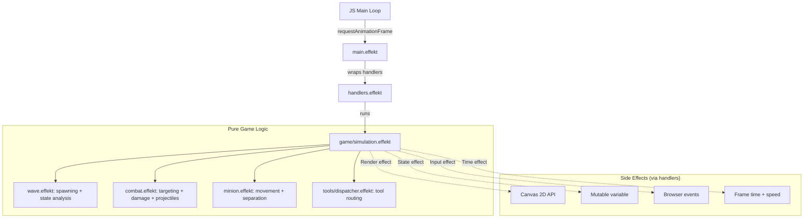

# Architecture Documentation

## 1. Overview

The Wave Management Simulator is built in **Effekt**, a functional programming language with algebraic effects and lightweight effect polymorphism. It compiles to JavaScript and runs in the browser, rendering the game via the HTML5 Canvas 2D API.

The central architectural idea is **separating pure game logic from side effects** using Effekt's effect system. All I/O (rendering, input, state persistence) is expressed through abstract effect interfaces and handled by swappable implementations -- real handlers for the browser, mock handlers for tests.

---

## 2. High-Level Architecture

The application follows a functional **game loop** pattern with four layers:

```
Browser (JS)          Effekt Runtime           Game Logic
─────────────         ──────────────           ──────────
requestAnimationFrame
  │
  ├─► $gameLoop()
  │     │
  │     └─► runToplevel($doGameStep)
  │           │
  │           ├─► loadState()        ◄── window.$gameState
  │           │
  │           ├─► withState { ... }       ┐
  │           ├─► withCanvasRenderer      │ Effect handlers
  │           ├─► withBrowserInput        │ wrap pure logic
  │           ├─► withTime               ┘
  │           │     │
  │           │     └─► gameLoopStep(dt)
  │           │           ├─► handleInput
  │           │           ├─► simulationStep
  │           │           └─► renderGame
  │           │
  │           └─► saveState()        ──► window.$gameState
  │
  └─► requestAnimationFrame (next frame)
```

### Data Flow



---

## 3. The Effect System

The core of the architecture revolves around four algebraic effects defined in `src/effects.effekt`. Each effect declares an interface of operations that the game logic can call without knowing the implementation.

### 3.1. Effect Definitions

**State** (`src/effects.effekt:10`)

```effekt
interface State {
  def getState(): GameState
  def setState(state: GameState): Unit
}
```

Provides read/write access to the complete game state. Helper functions (`getMinions`, `setMinions`, `setGameTime`, etc.) are built on top to avoid full-record reconstruction everywhere.

**Time** (`src/effects.effekt:19`)

```effekt
interface Time {
  def getCurrentTime(): Double
  def advanceTime(delta: Double): Unit
  def getSpeedMultiplier(): Double
}
```

Manages simulation time independently from wall-clock time. The speed multiplier applies to the delta so the simulation can run at 1x, 2x, or 4x.

**Input** (`src/effects.effekt:29`)

```effekt
interface Input {
  def getMousePosition(): Vec2
  def wasClicked(): Bool
  def isKeyDown(key: String): Bool
  def wasKeyJustPressed(key: String): Bool
}
```

Abstracts mouse and keyboard input. The real handler polls global JS variables; mock handlers inject test data.

**Render** (`src/effects.effekt:40`)

```effekt
interface Render {
  def clear(): Unit
  def drawMinion(minion: Minion): Unit
  def drawTurret(turret: Turret): Unit
  def drawHealthBar(pos: Vec2, current: Double, max: Double, width: Double): Unit
  def drawLane(): Unit
  def drawUI(state: GameState): Unit
  def drawToolPreview(tool: Tool, mousePos: Vec2): Unit
  def drawAttackLine(from: Vec2, to: Vec2, team: Team): Unit
  def drawMinionAttack(minion: Minion, target: Minion): Unit
  def drawProjectile(p: Projectile): Unit
  def drawVisualEffect(visualEffect: VisualEffect, currentTime: Double): Unit
  def drawTankIndicator(position: Vec2, isTanking: Bool, gameTime: Double): Unit
}
```

All drawing commands are abstract. The canvas handler translates them to HTML5 Canvas calls; the mock handler discards them.

### 3.2. Handler Implementations

All handlers are defined in `src/handlers.effekt`.

| Handler | Effect | Purpose |
|---------|--------|---------|
| `withState(initial)` | State | Maintains a mutable `var` holding the `GameState`. |
| `withTransientState(initial)` | State | Same as `withState` but returns the final state alongside the result. Used in production and testing. |
| `withTime(initialTime, speed)` | Time | Tracks simulation time; multiplies deltas by speed factor. |
| `withBrowserInput` | Input | Reads mouse/keyboard state from JS globals (`window.$mouseX`, etc.) via FFI. |
| `withMockInput(mousePos, clicked, keys)` | Input | Injects fixed input data for tests. |
| `withCanvasRenderer` | Render | Translates `Render` operations to HTML5 Canvas 2D API calls via FFI. |
| `withMockRenderer` | Render | No-op implementation that discards all draw calls (for testing). |

### 3.3. Handler Stacking

Each frame, handlers are stacked around the game logic in `processFrameImpl`:

```effekt
withState(state) {
  withCanvasRenderer {
    withBrowserInput {
      withTime(state.gameTime, state.speed) {
        gameLoopStep(dt)
      }
    }
  }
}
```

This creates a layered context where `gameLoopStep` can freely use any of the four effects. The handlers resolve each effect call to its concrete implementation.

### 3.4. Why Effects?

- **Testability**: Swap real handlers for mocks without changing game logic.
- **Separation of concerns**: Pure simulation code in `src/game/` never imports Canvas or DOM modules.
- **Composability**: Handlers compose by nesting. Adding a new capability (e.g., audio) means defining a new effect and handler without touching existing code.

---

## 4. Module Organization

### Core Modules

| File | Responsibility |
|------|---------------|
| `src/main.effekt` | Entry point. Initializes canvas and events, registers the frame callback, starts the browser animation loop. |
| `src/types.effekt` | All domain types (`GameState`, `Minion`, `Turret`, `Tool`, `WaveState`, etc.) and configuration constants. |
| `src/effects.effekt` | Effect interface definitions and convenience helpers (getters/setters that avoid full record reconstruction). |
| `src/handlers.effekt` | All handler implementations: state, time, input, render, and their mock variants. |

### Game Logic (`src/game/`)

| File | Responsibility |
|------|---------------|
| `simulation.effekt` | Orchestrates each frame: input handling, simulation step, rendering. Contains `gameLoopStep` -- the heart of the loop. |
| `wave.effekt` | Wave scheduling (`checkAndScheduleWaves`), pending spawn processing, and wave state analysis (`calculateWaveState`). |
| `minion.effekt` | Movement update, boids-like separation forces to prevent overlap, lane boundary clamping. |
| `combat.effekt` | Target selection, damage application, turret aggro, projectile creation and physics (`updateProjectiles`). |
| `turret.effekt` | Helper functions for creating turret entities. |
| `state.effekt` | `createInitialState` factory that builds the starting `GameState`. |

### Tools (`src/tools/`)

| File | Responsibility |
|------|---------------|
| `dispatcher.effekt` | Routes mouse clicks to the active tool's implementation based on `selectedTool`. |
| `lasthit.effekt` | Last-Hit tool: finds enemy minions below threshold HP near the click and kills them. |
| `aoe.effekt` | AoE tool: deals damage in a radius, capped to not kill (leaves at 1 HP). |
| `clear.effekt` | Kill Casters and Full Clear tools: removes specific minion subsets in a radius. |
| `tank.effekt` | Tank tool: sets the aggro point that draws minion attacks. |
| `utils.effekt` | Shared tool helpers (range checks, team filtering). |

### FFI (`src/ffi/`)

| File | Responsibility |
|------|---------------|
| `canvas.effekt` | `extern js` bindings to the HTML5 Canvas 2D context: `fillCircle`, `fillRect`, `strokeCircle`, `drawLine`, `fillText`, color/font setters. |
| `events.effekt` | `extern js` bindings for browser input: maintains global JS variables (`$mouseX`, `$mouseY`, `$clicked`, key state) updated by DOM event listeners, polled synchronously each frame. |

### Utils (`src/utils/`)

| File | Responsibility |
|------|---------------|
| `math.effekt` | `Vec2` record, vector arithmetic, distance, clamping, collision helpers. |
| `lists.effekt` | Functional list operations (filter, map, fold, find, contains, count). |
| `game.effekt` | Domain helpers: team swapping, speed multiplier lookup, wave state name strings, tool name strings. |

---

## 5. Simulation Loop Detail

`gameLoopStep(dt)` in `src/game/simulation.effekt` runs three phases per frame:

### Phase 1: Input Handling

- Checks keyboard for tool selection (`Q`/`W`/`E`/`R`/`T`), pause toggle (`Space`), speed changes (`1`/`2`/`3`).
- Checks for mouse clicks and routes them through `tools/dispatcher.effekt` to the active tool.

### Phase 2: Simulation Update (`simulationStep`)

Runs only when not paused:

1. **Wave scheduling** (`wave.effekt`): Checks if `gameTime >= nextSpawnTime`. If so, schedules a new wave by adding `PendingSpawn` entries with staggered spawn times.
2. **Pending spawn processing**: Materializes `PendingSpawn` entries whose `spawnTime` has passed into actual `Minion` entities.
3. **Movement** (`minion.effekt`): Updates each minion's position based on movement speed and direction. Applies separation forces (boids-like) to prevent overlapping. Clamps positions to lane boundaries.
4. **Combat** (`combat.effekt`): Selects targets for each minion and turret. Creates projectiles for ranged attacks. Updates projectile positions and applies damage on impact. Handles turret priority targeting (minions over champions).
5. **Cleanup**: Removes dead minions (`isAlive == false`) and expired visual effects.
6. **Wave state analysis** (`wave.effekt`): Calculates the current `WaveState` based on minion positions and counts.

### Phase 3: Rendering (`renderGame`)

1. `clear()` -- Wipe the canvas.
2. `drawLane()` -- Background, lane boundaries, turret zones.
3. `drawTurret(blueTurret)`, `drawTurret(redTurret)` -- Turrets with range indicators and health bars.
4. For each minion: `drawMinion(minion)` -- Colored circle with type-specific styling and health bar.
5. For each projectile: `drawProjectile(p)` -- Distinct visuals for turret/caster/melee.
6. For each visual effect: `drawVisualEffect(vfx, time)` -- Animated transient effects.
7. `drawTankIndicator(pos, isTanking, time)` -- Pulsing shield icon if tank is active.
8. `drawToolPreview(tool, mousePos)` -- Range circle preview for area tools.
9. `drawUI(state)` -- HUD overlay with time, wave number, counts, speed, tool, wave state.

---

## 6. Browser Integration

### 6.1. The Inversion of Control Pattern

Effekt cannot run a blocking `while(true)` loop in the browser. Instead, the browser drives the loop via `requestAnimationFrame`, and the compiled Effekt logic is injected as a callback.

### 6.2. Frame Lifecycle

1. **Initialization** (`main.effekt`): Runs once on page load. Calls `initCanvas()` and `initEvents()` via FFI. Registers `processFrameImpl` as `window.$doGameStep`. Calls `startLoop()` to begin `requestAnimationFrame`.

2. **Frame execution** (JS side): `$gameLoop()` fires ~60 times/sec. Calls `window.$effekt.runToplevel(window.$doGameStep)` to execute the Effekt frame function within the runtime.

3. **Input snapshot** (`ffi/events.effekt`): Browser events (`mousemove`, `keydown`, `keyup`, `click`) asynchronously update global JS variables. `withBrowserInput` reads these synchronously at frame start, converting async DOM events into a deterministic input snapshot.

4. **State persistence**: Since the Effekt stack unwinds after each frame, `GameState` is stored in `window.$gameState`. Each frame: `loadState()` reads it at the start, `saveState(newState)` writes it at the end.

### 6.3. FFI Pattern

Effekt interacts with JavaScript through `extern js` blocks:

```effekt
extern js """
  function fillCircle(x, y, r) {
    ctx.beginPath();
    ctx.arc(x, y, r, 0, Math.PI * 2);
    ctx.fill();
  }
"""
```

The FFI layer is confined to `src/ffi/`. All other modules use only Effekt-level abstractions (effects and handlers).

---

## 7. Key Data Structures

### GameState

The central record holding all simulation state (defined in `src/types.effekt:253`):

| Field | Type | Purpose |
|-------|------|---------|
| `minions` | `List[Minion]` | All active minions |
| `blueTurret` / `redTurret` | `Turret` | The two turrets |
| `gameTime` | `Double` | Simulation time in seconds |
| `waveNumber` | `Int` | Current wave count |
| `nextSpawnTime` | `Double` | When the next wave spawns |
| `isPaused` | `Bool` | Pause state |
| `speed` | `SimulationSpeed` | 1x, 2x, or 4x |
| `selectedTool` | `Tool` | Currently active tool |
| `nextEntityId` | `Int` | Auto-incrementing ID counter |
| `waveState` | `WaveState` | Current wave equilibrium |
| `isPlayerTanking` | `Bool` | Whether tank tool is active |
| `tankPosition` | `Vec2` | Where the player is tanking |
| `projectiles` | `List[Projectile]` | Active projectiles |
| `pendingSpawns` | `List[PendingSpawn]` | Queued minion spawns |
| `visualEffects` | `List[VisualEffect]` | Active visual effects |

### Configuration Constants

Key constants defined in `src/types.effekt`:

| Constant | Value | Purpose |
|----------|-------|---------|
| `SPAWN_INTERVAL` | 30.0s | Time between wave spawns |
| `CANNON_WAVE_INTERVAL` | 3 | Cannon spawns every 3rd wave |
| `TURRET_STATS` | 5000 HP, 152 AD, 0.83 AS, 150 range | Turret stats |
| `AOE_RADIUS` / `AOE_DAMAGE` | 80.0 / 150.0 | AoE tool parameters |
| `FULL_CLEAR_RANGE` | 200.0 | Full Clear and Kill Casters range |
| `LASTHIT_THRESHOLD` | 50.0 | HP threshold for last-hitting |
| `CANVAS_WIDTH` / `CANVAS_HEIGHT` | 1200 / 400 | Canvas dimensions |
| `LANE_Y` | 200.0 | Vertical center of the lane |

---

## 8. Maintenance Guidelines

### Adding a New Tool

1. **Define the variant**: Add a new case to `type Tool` in `src/types.effekt`.
2. **Create the implementation**: Add a new file `src/tools/<toolname>.effekt` with the tool's logic function.
3. **Register in dispatcher**: Add a case to `handleToolClick` in `src/tools/dispatcher.effekt` that calls your function.
4. **Add keyboard binding**: In `src/game/simulation.effekt`, add a `wasKeyJustPressed` check in the input handling phase.
5. **Add tool preview** (optional): Add a case to `drawToolPreview` in `src/handlers.effekt` for visual feedback.
6. **Update `toolName`**: Add the display name in `src/utils/game.effekt`.

### Adding a New Minion Type

1. **Define the variant**: Add a case to `type MinionType` in `src/types.effekt`.
2. **Define stats**: Update `getMinionStats` in `src/game/minion.effekt` with HP, damage, speed, range.
3. **Update rendering**: Add a color/shape case in `drawMinion` inside `src/handlers.effekt`.
4. **Update spawning**: Add the type to `scheduleTeamWave` in `src/game/wave.effekt`.

### Adding a New Visual Effect

1. **Define the variant**: Add a case to `type VisualEffectType` in `src/types.effekt`.
2. **Trigger it**: Where the event occurs (e.g., in `combat.effekt`), call `addVisualEffect(...)`.
3. **Render it**: Add a case in `drawVisualEffect` inside `src/handlers.effekt`.

### Adding a New Effect (Capability)

1. **Define the interface**: Create a new `interface` in `src/effects.effekt`.
2. **Implement the handler**: Add a `with<Name>` handler in `src/handlers.effekt`.
3. **Add a mock handler**: For testing, add a `withMock<Name>` handler.
4. **Stack it**: Add the handler to the nesting chain in `processFrameImpl` (`src/main.effekt`).

### Testing

Tests live in `src/test.effekt` and use mock handlers to run game logic without a browser:

```effekt
withTransientState(initialState) {
  withMockRenderer {
    withMockInput(mousePos, clicked, keys) {
      withTime(0.0, Speed1x()) {
        // run game logic, then assert on final state
      }
    }
  }
}
```

Run with: `effekt src/test.effekt`

### Common Pitfalls

- **Record updates**: `GameState` is immutable. Every update requires reconstructing the full record. Use the helper setters in `src/effects.effekt` (e.g., `setMinions`, `setGameTime`) to avoid mistakes.
- **Entity IDs**: Always use `getNextEntityId()` to generate unique IDs. Never hardcode or reuse IDs.
- **Effect leaks**: If a function uses an effect, it must appear in the type signature (e.g., `/ State`). The compiler enforces this, but forgetting to propagate effects causes confusing errors.
- **FFI boundaries**: Keep `extern js` blocks minimal and confined to `src/ffi/`. Use Effekt-level abstractions everywhere else.
- **State persistence**: `GameState` is serialized to a JS global each frame. All fields must be serializable by the Effekt-to-JS compiler.
